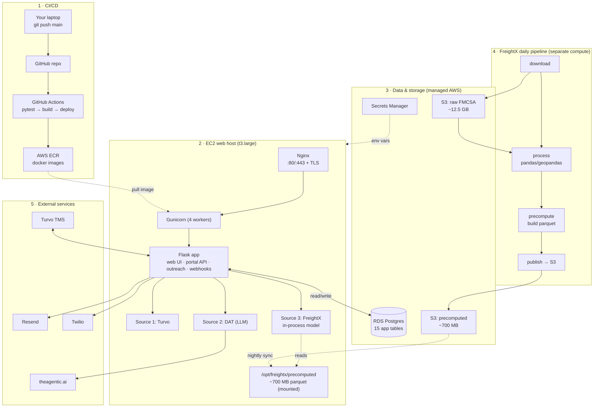

# Spot Bid Agent — Deployment Handoff

> A complete, self-contained guide for deploying this project to AWS.
> Audience: a deployer/DevOps engineer who has **not** seen this codebase before.
> Last updated for: Flask monolith + in-process FreightX model, single EC2 + RDS.

---

## 1. What this project is

Spot Bid Agent is an AI-assisted tool for US freight spot bidding. When a shipment is tagged
`#spotbid` in the Turvo TMS, the app finds candidate carriers from three sources, sends outreach
(email/SMS/WhatsApp), tracks engagement, and shows a per-lane dashboard.

**It is a single Python/Flask monolith.** There is no separate frontend service — the UI is
server-rendered Jinja templates + vanilla JS served by the same app.

### Tech stack

| Layer | Technology |
|---|---|
| Language | Python ≥ 3.11 |
| Web framework | Flask 3.x |
| WSGI server | Gunicorn |
| ORM | SQLAlchemy 2.x |
| DB (local dev) | SQLite (file) |
| DB (production) | **PostgreSQL (AWS RDS)** ← must switch to this |
| Email | Resend |
| SMS / WhatsApp | Twilio |
| LLM (DAT CSV parsing) | theagentic.ai (OpenAI-compatible API) |
| Logging / tracing | structlog + OpenTelemetry (optional Grafana Cloud) |

---

## 2. Architecture



**The one idea that explains the whole design:** the web app and the FreightX *data pipeline* are
decoupled. The web app needs only the **~700 MB precomputed models**; the **12.5 GB of raw data**
lives in S3 and is touched only by the daily pipeline. See §6.

---

## 3. Repository layout

```
Spot Bid Agent/
├── backend/                      # THE DEPLOYABLE APP
│   ├── app/
│   │   ├── main.py               # create_app() + module-level `app` (Gunicorn entry: app.main:app)
│   │   ├── core/settings.py      # all config via env vars (pydantic-settings)
│   │   ├── db/
│   │   │   ├── base.py           # engine, session, create_tables()
│   │   │   ├── models.py         # 15 tables = the DB schema
│   │   │   └── migrations.py     # ⚠ SQLite-only (PRAGMA) — replace with Alembic
│   │   ├── portal/               # lanes, carriers (3 sources), outreach, aggregation
│   │   ├── webhooks/             # Turvo trigger, Resend events + inbound replies
│   │   └── health/               # health check endpoint
│   ├── pyproject.toml            # backend dependencies
│   └── tests/                    # pytest
├── FreightX-V1/                  # SEPARATE PROJECT (carrier relevancy model) — see §6
│   ├── data/                     # ~12.5 GB raw FMCSA CSVs  → DO NOT commit / DO NOT ship in image
│   ├── src/api/models/           # model code + precomputed_modelN/ (~700 MB parquet)
│   └── scripts/main.py           # the daily rebuild pipeline
├── docs/                         # specs + this file
├── .env / .env.example           # config template
└── Carrire Data.csv              # local carrier contact cache
```

**Gunicorn entry point:** working dir `backend/`, command:
`gunicorn --bind 0.0.0.0:8000 --workers 4 app.main:app`

---

## 4. Pre-deploy code changes (REQUIRED)

The app runs on SQLite today. Two things **must** change before production:

### 4.1 Switch DB to PostgreSQL
- `backend/app/core/settings.py` defaults `database_url` to SQLite. Override with
  `DATABASE_URL=postgresql+psycopg2://...` in production env. The models already work on Postgres
  (`base.py` handles the SQLite-vs-Postgres connect args).

### 4.2 Replace the migration logic with Alembic
- `backend/app/db/migrations.py` uses `PRAGMA table_info(...)` — **SQLite-only, crashes on Postgres.**
- `backend/app/main.py` calls `create_tables()` + `run_column_migrations(engine)` on every boot.
- Action: add **Alembic** (`alembic`, plus `psycopg2-binary` is already a dependency), generate the
  initial migration from `models.py`, run `alembic upgrade head` on deploy, and remove the
  `run_column_migrations` call. `create_tables()` (SQLAlchemy `create_all`) is **non-destructive**
  (it only creates missing tables) so it is safe to leave, but Alembic should own schema changes.

> **Does data get wiped on deploy/restart?** No — once on RDS, the database is a separate server.
> Replacing the app container or rebooting the host never touches it. `create_all` only creates
> tables that don't exist; it never drops rows. The "empty DB on restart" risk exists *only* with
> SQLite-in-the-container, which this migration eliminates.

---

## 5. Environment variables

All config is read from environment variables via `pydantic-settings`. In production, store these in
**AWS Secrets Manager** and render them into `/opt/spot-bid-agent/.env.production` on the host (never
commit secrets). Full list (see `.env.example` for the template):

| Variable | Required | Purpose |
|---|---|---|
| `APP_ENV` | yes | `production` |
| `DATABASE_URL` | **yes** | `postgresql+psycopg2://user:pass@<rds-endpoint>:5432/spotbid` |
| `LOG_LEVEL` | no | `INFO` |
| `FREIGHTX_SRC_API_PATH` | **yes** | path to FreightX `src/api` inside the container, e.g. `/opt/freightx/src/api` |
| `CARRIER_DATA_CSV_PATH` | yes | path to `Carrire Data.csv` in the container |
| `TURVO_WEBHOOK_SECRET` | yes | verify Turvo `#spotbid` webhooks |
| `TURVO_DB_URL` | if used | Turvo internal DB for carrier recommendations |
| `TURVO_API_CLIENT_ID` / `TURVO_API_CLIENT_SECRET` | if used | Turvo carrier enrichment API |
| `TURVO_MOCK_CARRIERS` | no | `false` in prod (mock data toggle) |
| `LLM_BASE_URL` / `LLM_MODEL` / `LLM_API_KEY` | yes | DAT CSV parsing (theagentic.ai) |
| `RESEND_API_KEY` | yes | send email |
| `RESEND_FROM_EMAIL` | yes | verified sender address |
| `RESEND_WEBHOOK_SECRET` | yes | verify Resend event/reply webhooks |
| `TWILIO_ACCOUNT_SID` / `TWILIO_AUTH_TOKEN` | yes | SMS + WhatsApp |
| `TWILIO_SMS_FROM` / `TWILIO_WHATSAPP_FROM` | yes | sending numbers |
| `FMCSA_X_APP_TOKEN` / `TRIMBLE_API_KEY` | pipeline | used by FreightX data download (`FreightX-V1/.env`) |
| `OTEL_EXPORTER_OTLP_ENDPOINT` / `OTEL_EXPORTER_OTLP_HEADERS` | no | tracing to Grafana Cloud |
| `GRAFANA_CLOUD_LOKI_*` | no | log shipping |

---

## 6. FreightX — the special case (READ THIS CAREFULLY)

`FreightX-V1/` is a **separate data-science project** that this app calls to get ranked carriers for
a lane. It is invoked **in-process**: `backend/.../source_3_freightx/adapter.py` injects
`FreightX-V1/src/api` onto `sys.path` and calls `run_my_model(...)`. That function reads precomputed
**parquet** files at query time.

### Size breakdown (total ~13.2 GB)

| Path | Size | Needed by | Where it goes |
|---|---|---|---|
| `FreightX-V1/data/*.csv` (raw FMCSA: census 2 GB, inspections 3.7 GB, etc.) | **~12.5 GB** | the daily pipeline only | **S3** `s3://freightx-raw/` |
| `FreightX-V1/src/api/models/precomputed_*/` (parquet + `carrier.db`) | **~700 MB** | the web app at query time | **EBS** on web host, synced nightly from S3 |
| `FreightX-V1/src/api/**/*.py` (model code) | tiny | the web app | baked into the Docker image |

### Rules
1. **Never commit `data/` or `precomputed_*` to git, and never bake the 12.5 GB into the Docker image.**
   Add them to `.gitignore`. Ship only the FreightX Python code.
2. The web container must mount the precomputed models read-only (e.g. at `/opt/freightx/precomputed`)
   and set `FREIGHTX_SRC_API_PATH=/opt/freightx/src/api`.
3. **The web image must also install FreightX's dependencies** (`geopandas`, `shapely`, `pyogrio`,
   `pandas`, `numpy`, `openpyxl`, …) because the model runs *in the web process*. These are listed in
   `FreightX-V1/pyproject.toml`, NOT in `backend/pyproject.toml`. Install both dependency sets into
   the web image.
4. The **12.5 GB raw data and the heavy pandas/geopandas rebuild never run on the web host.** They run
   on separate compute (see §10).

> **Future cleanup (optional):** the cleanest long-term design is to run FreightX as its own service
> (its own container exposing an HTTP endpoint) and change `adapter.py` to call it over HTTP instead
> of in-process. That removes the heavy geo deps from the web image. Not required for MVP.

---

## 7. AWS resources to provision

| Resource | Spec | Notes |
|---|---|---|
| **EC2 (web)** | see §7.1 | runs Nginx + Docker + the app |
| **RDS** | see §7.3 | the production database |
| **ECR** | one private repo, e.g. `spot-bid-agent` | stores web images |
| **S3** | `freightx-raw` (12.5 GB) + `freightx-precomputed` (700 MB) | lifecycle/versioning optional |
| **Secrets Manager** | one secret with all env vars | rendered to `.env.production` on host |
| **EC2 (pipeline)** | see §7.2 | rebuilds FreightX models daily |
| **IAM role** | EC2 instance profile with S3 + ECR + Secrets read | least privilege |
| **Security groups** | web: 80/443 from internet, 22 from admin IP only; RDS: 5432 from web SG only | |
| **Elastic IP** | one, attached to the web EC2 | stable address for DNS + webhooks |

### 7.1 Web EC2 — recommended parameters

This host runs the Flask app **and** the FreightX model in-process. Because the model loads the
precomputed parquet + `carrier.db` (~700 MB + 312 MB) into memory *per request*, and Gunicorn runs
4 worker processes, peak memory under concurrent lane lookups is the sizing driver — not CPU.

| Parameter | Recommendation | Why |
|---|---|---|
| Instance type | **`t3.xlarge`** (4 vCPU, 16 GB RAM) | safe headroom for the in-process model across 4 workers. `t3.large` (8 GB) can work for low concurrency but risks OOM when several FreightX lookups run at once. |
| Alternative (steady load) | `m7i.large` / `m7i.xlarge` | non-burstable, consistent CPU if traffic becomes sustained rather than spiky |
| Cheaper alternative | `t4g.xlarge` (ARM/Graviton, ~20% less) | only after confirming `geopandas`/`pyogrio`/GDAL install cleanly on arm64; use x86 first |
| CPU model | **burstable (t3)** is fine for MVP | spot-bid triggers are sporadic; watch CPU-credit balance in CloudWatch |
| Architecture | **x86_64 (amd64)** for first deploy | avoids any arm64 wheel/GDAL surprises with the geo stack |
| OS / AMI | **Ubuntu 22.04 LTS** (or 24.04 LTS) | best Docker + GDAL/GEOS/PROJ apt support; widely documented. (Amazon Linux 2023 is a fine alternative.) |
| Root volume | **gp3, 30 GB** | OS + Docker images + 700 MB precomputed models + logs, with room to spare |
| Public IP | Elastic IP | stable for DNS and inbound webhooks (Turvo/Resend/Twilio) |

> Tuning note: if memory is tight, prefer **fewer Gunicorn workers** (e.g. 2) over a bigger box,
> since each worker can independently load the model. Validate peak memory with a couple of
> concurrent FreightX lane lookups before locking in the instance size.

### 7.2 Pipeline EC2 — recommended parameters

This runs the daily rebuild that ingests the **12.5 GB** of raw FMCSA CSVs with pandas/geopandas.
Pandas can use several times a file's size in RAM (the largest input is ~3.7 GB), so this box is
**memory-optimized** and short-lived.

| Parameter | Recommendation | Why |
|---|---|---|
| Instance type | **`r6i.2xlarge`** (8 vCPU, 64 GB RAM) | comfortably holds the largest CSVs in memory during processing. `r6i.xlarge` (32 GB) is the floor — test before trusting it. |
| Lifecycle | **start → run → stop daily** (EventBridge + Lambda, or AWS Batch) | you pay only for the ~1–2 h/day it runs, not 24/7 |
| OS / AMI | Ubuntu 22.04 LTS | same geo stack as the web host |
| Storage | **gp3, 150–200 GB** | holds the 12.5 GB raw set + intermediate files + the 700 MB output |
| Not the web host | must be separate compute | keeps the heavy batch job off the live web tier |

### 7.3 RDS — recommended parameters

| Parameter | Recommendation | Why |
|---|---|---|
| Engine | **PostgreSQL 16** | matches the SQLAlchemy models |
| Instance | **`db.t4g.small`** (or `db.t3.micro` free tier to start) | 15 small tables; low write volume at MVP |
| Storage | gp3, 20 GB, storage autoscaling on | grows automatically as outreach history accumulates |
| Multi-AZ | off for MVP, **on for production** | failover/HA once this is business-critical |
| Networking | private subnet, **not publicly accessible** | reachable only from the web EC2's security group on 5432 |
| Backups | automated, 7-day retention | point-in-time recovery |

---

## 8. How the app should be containerized (web app)

The web app should be packaged as a single Docker image. The image must:

- Start from a Python 3.11+ base.
- Install the OS libraries that `geopandas` / `shapely` / `pyogrio` and `psycopg2` need
  (GEOS, PROJ, GDAL, libpq).
- Install **both** dependency sets: `backend/pyproject.toml` **and** FreightX's geo libraries
  (`geopandas`, `shapely`, `pyogrio`, `pandas`, `numpy`, `openpyxl`) — see §6 for why.
- Copy in the app code (`backend/`) and the FreightX **code only** (`FreightX-V1/src`) plus
  `Carrire Data.csv`. **Do not copy** `FreightX-V1/data/` or the precomputed models.
- Run Gunicorn: 4 workers, bind `0.0.0.0:8000`, entry point `app.main:app`.

The runtime should be orchestrated with Docker Compose on the host, configured to:

- pull the image from ECR and publish port 8000,
- load environment from `/opt/spot-bid-agent/.env.production`,
- set `FREIGHTX_SRC_API_PATH` to the FreightX `src/api` path inside the container,
- mount the precomputed models (synced from S3) read-only into the model directory,
- restart automatically unless stopped.

---

## 9. CI/CD pipeline (recommended: GitHub Actions)

A pipeline that triggers on every push to `main` and performs these stages:

1. **Test** — install the backend with dev extras and run `pytest backend/tests/`. Stop if tests fail.
2. **Build** — build the Docker image (§8), tagging it with the commit id.
3. **Push** — authenticate to ECR and push the image.
4. **Deploy** — over SSH to the web EC2: pull the new image, **run the DB migration**
   (`alembic upgrade head`) *before* swapping, then start the new container.

**Secrets the pipeline needs:** ECR registry URL, EC2 host, EC2 SSH key, and AWS credentials with
ECR push + deploy permissions.

The net effect: a code change becomes a live deploy in a few minutes with no manual steps. Rollback
is redeploying a previous image tag.

---

## 10. FreightX daily pipeline deployment

The pipeline rebuilds the precomputed models from raw data. It must run on **separate compute**, not
the web host.

1. Provision pipeline compute (scheduled `r6i.xlarge` EC2 that starts, runs, stops; or AWS Batch).
2. It needs `FreightX-V1/` code + its venv (`geopandas`, `shapely`, `pyogrio`, etc.) and the FMCSA /
   Trimble API keys (`FreightX-V1/.env`).
3. Daily job (cron / EventBridge):
   - download raw datasets (`FreightX-V1/data/Dataset_download_script.py`) → upload to `s3://freightx-raw/`
   - run `FreightX-V1/scripts/main.py` + the `precompute_modelN` steps
   - upload the rebuilt `precomputed_*` to `s3://freightx-precomputed/`
4. On the **web host**, a nightly job syncs the fresh precomputed models down from
   `s3://freightx-precomputed/` to the mounted directory, then restarts the web container so it picks
   up the new models.

---

## 11. Reverse proxy + TLS (on the web host)

Put **Nginx** in front of Gunicorn:

- Nginx listens on ports 80/443 and proxies to Gunicorn on `127.0.0.1:8000`, forwarding the original
  host and client IP headers.
- Use **Certbot (Let's Encrypt)** to issue and auto-renew a free TLS certificate for the domain.

---

## 12. Operations runbook (what each task means)

| Task | What it does |
|---|---|
| Deploy new code | automatic on push to `main` (see §9) — test, build, migrate, swap container |
| Manual deploy | pull the latest image and restart the web container |
| Run DB migration | apply schema changes to RDS before the new code goes live |
| Rollback | redeploy a previous image tag; data is unaffected |
| View logs | tail the web container logs |
| Restart app | restart the container — **data is safe, it lives in RDS** |
| Refresh FreightX models | sync the latest precomputed models from S3, then restart the app |
| Health check | the app exposes a health endpoint at `/health` for load-balancer / uptime checks |

---

## 13. First-time setup checklist

- [ ] Add `FreightX-V1/data/` and `FreightX-V1/src/api/models/precomputed_*` to `.gitignore`
- [ ] Create RDS Postgres; note the endpoint
- [ ] Add Alembic; generate initial migration from `models.py`; remove `run_column_migrations`
- [ ] Create ECR repo + S3 buckets (`freightx-raw`, `freightx-precomputed`)
- [ ] Upload current precomputed models to `s3://freightx-precomputed/`
- [ ] Write `backend/Dockerfile` + `docker-compose.yml` (§8); test image locally
- [ ] Provision web EC2; install Docker, Nginx, Certbot, AWS CLI
- [ ] Create `/opt/spot-bid-agent/.env.production` from Secrets Manager
- [ ] Mount precomputed models at `/opt/freightx/precomputed`; add nightly S3 sync cron
- [ ] Configure GitHub Actions secrets; push to `main` for first deploy
- [ ] Run `alembic upgrade head` to create the 15 tables in RDS
- [ ] Point Turvo / Resend / Twilio webhooks at `https://your-domain.com/...`
- [ ] Stand up the pipeline compute (§10) on its daily schedule

---

## 14. Key facts for the deployer (quick reference)

- The deployable unit is **`backend/`**. Gunicorn entry: `app.main:app`, port 8000.
- Python **≥ 3.11**. Dependencies in `backend/pyproject.toml` (+ FreightX geo deps, see §6).
- **15 DB tables** defined in `backend/app/db/models.py`; that file *is* the schema.
- Production DB is **RDS Postgres** — deploys/restarts do **not** wipe data.
- **FreightX raw data (12.5 GB) goes to S3, never the web host.** Web host only needs the 700 MB
  precomputed models, mounted read-only.
- Webhooks the app exposes: Turvo `#spotbid` trigger, Resend events + inbound replies.
